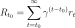
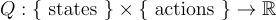
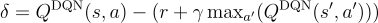

# DQN Projects
The goal of this repository is to show some projects I have been working on in my free time. 
Currently, I am implementing a DQN to play Connect Four. 
This is done using the PyTorch library, and the code is based on https://pytorch.org/tutorials/intermediate/reinforcement_q_learning.html.
We begin by creating an environment that allows us to play Connect Four in Python.
This is done by defining a class that incorporates the game logic. 

#The idea behind the DQN
Before we begin to explain our implementation of a DQN, let us briefly recall the ideas. 
The goal is to maximize our long-term return.
This is built up as a sum of short-term rewards, that we obtain after each turn, multiplied by a 'discount' between 0 and 1 which makes rewards in the far future more uncertain. 

In an ideal world, we could wish for a function 

that would tell us our return for each pair of state and action, such that for each state we could simply pick the action that maximizes this function.
Unfortunately, our world is not perfect and we do not have such a function. 
However, this is where neutral networks as universal function approximators come into play. 
So the idea is to train a neural network to resemble this desired function Q.
Using Bellman's principle of optimality, we can express the return at time t as a combination of the short-term reward for a given action, together with the (discounted) return of the remaining decision problem that results from the chosen action.
Hence Q should satisfy 
Q(s,a) = r + \gamma Q(s',argmax a')
If our neural network Q approximates the unknown Q function, we should expect that it also satisfies this equation, and this is what we are trying to archive during our optimization steps. 
The failure of this equation to hold is known as the temporal difference error which we denote by \delta.

For a given loss function \mathcal{L} and a batch of observed transitions $B$ that contain tuples (s,a,s',r), we want to minimize 
\mathcal{L} = 1/ \vert B \vert \sum_{B}\mathcal{L}(\delta)

#The implementation
Now that we have explained the idea behind the network, let us discuss its implementation.
We implement a separate network for each Player such that each network will only play on odd/even turns. 
Furthermore, to improve stability, we will use two networks of the same depth and size for each player, called policy_net and target_net. 
During each optimization step, we will start by sampling a batch B of a specified size and calculate the temporal difference error for every element as
policy_net(s) -(r+\gamma max_{a'} target_net(s',a')))
and optimize the parameters of policy_net such that our chosen loss function becomes minimal. 
Then we will update the parameters of target_net as a convex combination of the newly optimized parameters of policy_net and the old parameters of target_net.
After initializing the networks and implementing the optimization procedure, we let both networks play against each other in a training loop. 
A full turn inside this loop consists of both players playing a move.
For each player, we will collect tuples (s,a,s',r) where
-s is the current state of the board before playing a move
-a is the selected move
-s' is the next state where the SAME player can choose an action again. For example, player 1 sees a state s and selects an action a. Then, we let player 2 also play their turn. The resulting state after player 2's move will be s'.
-r is the reward that is obtained after both players have selected an action.

#CURRENT STATE
To test the performance of the trained network, we let it play against a randomly acting player. 
In this scenario, our trained player consistently outperforms the untrained player, both as player 1 and player 2. 

However, when comparing the win rate against classical alpha-beta pruning, it becomes clear that our model has a lower win rate.
On the other hand, depending on the search depth of our alphaBetaPlayer, the computational time needed to select an action is considerably lower once the DQN is trained.
For a series of 1000 games against a random player and a selected search depth of 3, the computational time needed already differed by a factor of 10.
For depth 1 they have about the same computational time.
CHECK
When directly testing our trained player against the alpha-beta player we obtain the following diagram in terms of search depth MAKE

We see that with increasing depth, the win rate of the alpha-beta player increases.
However, when both players have the same time to make their decision, that is for depth =1, we see that our trained player actually has the advantage.

However, when tested against a human player, it becomes clear that the current decision-making is far from optimal. 
It is relatively easy to construct situations with clear winning/losing moves that seem to be ignored by our trained player. 
The reasons for this, and possible improvements, need to be further investigated. 

