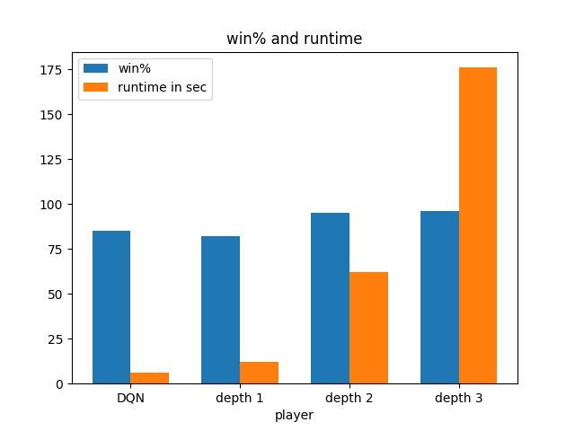
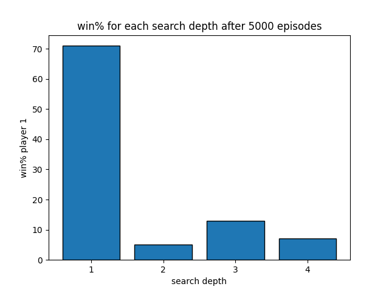

# DQN Projects
The goal of this repository is to show a project related to neural networks and deep learning. 
The project shown here is implementing a DQN to play Connect Four. 
This is classically done with tree-based search algorithms such as alpha-beta pruning.
However, we want to explore to what extent a DQN can archive the same task and compare the results.
The code is based on the PyTorch library as shown in https://pytorch.org/tutorials/intermediate/reinforcement_q_learning.html.

# The environment
We begin by creating an environment to play Connect Four in Python.
This game is played by two players against each other on a $6 \times 7$, vertically mounted grid. 
Each player has game tokens of a chosen colour which are inserted at the top of the board such that they fall to the free space in the grid. 
The player who first manages to build a row of four neighboring (horizontally, vertically, or diagonally) tokens wins the game. 

To play this game in Python, we define a class that allows us to represent the board and allows us to take turns according to the game logic.
The board is represented by a $6 \times 7$ matrix with $0$ on every empty field, $1$ for the tokens of player $1$, and $-1$ for the tokens of player $2$. 
Among others, the board admits a play() and check_win() method that allows us to make moves and check whether the win condition for any player is satisfied.
For ease of notation during the training, we combine these into a single method called step(). 

# The idea behind the DQN
Before we begin to explain our implementation of a DQN, let us briefly recall the ideas. 
The aim is to maximize our long-term return for a given context.
This can be the return of a portfolio in finance, or as simple as "winning" or "losing" at the end of the game as in our case.
The long-term return is built up as a sum of short-term rewards, that we obtain after each turn or time-step, multiplied by a 'discount' $\gamma$ between 0 and 1 which makes rewards in the far future more uncertain or less valuable than an immediate reward. 
Hence we can write our discounted return $R_{t_0}$ at time $t_0$ as

$$R_{t_0} = \sum_{t=t_0}^\infty \gamma^{t-t_0}r_t.$$

In an ideal world, we would wish for a function 

$$Q: \lbrace \mathrm{ states } \rbrace \times \lbrace \mathrm{ actions } \rbrace \to \mathbb{R}$$

that would tell us our return for each pair of state and action, such that for each state we could simply pick the action that maximizes this function.
Unfortunately, our world is not perfect and we do not have such a function. 
However, this is where neutral networks as universal function approximators come into play. 
The idea is to train a neural network $Q^{\mathrm{DQN}}$ to approximate the function $Q$.
Using Bellman's principle of optimality, we can express the return at time $t$ as a combination of the short-term reward for a given action, together with the (discounted) return of the remaining decision problem that results from the chosen action.
Hence $Q$ should satisfy 

$$Q(s, a) = r + \gamma  \cdot \mathrm{max}_{a'}(Q(s', a'))$$

If our neural network $Q^{\mathrm{DQN}}$ approximates the unknown $Q$ function, we should expect that it also satisfies this equation, at least up to a very small error, and this is what we are trying to achieve during our optimization steps. 
The failure of this equation to hold is known as the temporal difference error which we denote by $\delta$.

$$ \delta = Q^{\mathrm{DQN}}(s,a) -(r + \gamma \cdot \mathrm{max}_{a'}(Q^{\mathrm{DQN}}(s',a')))$$

For a given loss function $\mathcal{L}$ and a batch of observed transitions $B$ that is made up of tuples $(s,a,s',r)$, we want to minimize 

$$\frac{1}{\vert B \vert} \sum_{B}\mathcal{L}(\delta).$$

# The implementation
Now that we have explained the idea behind the network, let us discuss its implementation.
We build a separate network for each Player such that each network will only play on odd/even turns. 
Furthermore, to improve stability, we will use two networks of the same depth and size for each player, called $\mathrm{policy}$ and $\mathrm{target}$. 
We start by letting our networks choose actions in alternating order if a certain threshold is satisfied, otherwise, we play random.
If one player wins, the board is reset and we start with a new game.
After each full turn, we save the observed data.
For each player, we will collect tuples $(s, a, s',r)$ where

 * $s$ is the current state of the board before playing a move
 * $a$ is the selected move
 * $s'$ is the next state where the same player can choose an action again. For example, player 1 sees a state $s$ and selects an action a. Then, we let player 2 also play their turn. The resulting state after player 2's move will be s'.
 * $r$ is the reward that is obtained after both players have selected an action.

Once enough data is collected, we start to optimize our networks after each turn.
During each optimization step, we will start by sampling a batch $B$ of a specified size from our observations and calculate the temporal difference error for every tuple as

$$\mathrm{policy}(s) -(r+\gamma \mathrm{max}_{a'}( \mathrm{target}(s', a'))).$$

Then, we optimize the parameters of $\mathrm{policy}$ such that our chosen loss function becomes minimal. 
Once that is done, we will update the parameters of $\mathrm{target}$ as a convex combination of the newly optimized parameters of $\mathrm{policy}$ and the old parameters of $\mathrm{target}$.
We will only update the parameters of $\mathrm{target}$ in small steps to ensure stability. 
This loop is iterated after a certain amount of episodes is reached.

# Summary of the current state 
To test the performance, we run a total of 5000 training episodes and then let the DQN-trained player play against a randomly acting player. 
The results of the training are stored in 'trained_1_5000.pth' and 'trained_2_5000.pth'.
In this scenario, our trained player has a consistently high win rate against the untrained player in a series of 1000 games. 

 * As player 1: 86% win rate
 * As player 2: 77% win rate

Next, we compared the trained player against classical alpha-beta pruning of varying depths we measured both win percentage and runtime. 
The win percentage and runtime compared to alpha-beta pruning of depth 1 to 3 over a series of 1000 games are shown below
(The code was run on an 1,4 GHz Intel Core i5-8257U).

We see that the DQN slightly outperforms alpha-beta pruning with depth 1 in win percentage and has the upper hand in runtime. 
For higher depths, the DQN player begins to lose out on win percentage but has a significant advantage in terms of runtime.

When directly testing our trained player against the alpha-beta player, we obtain the following diagram.

The diagram shows that with increasing depth, the win rate of the player using alpha-beta pruning increases.
However, when both players have comparable time to make their decision (at depth one), we see that the DQN-trained player has the advantage.
